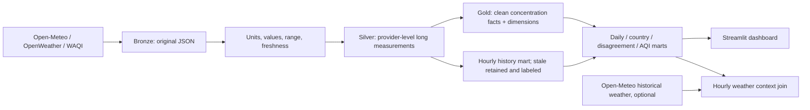

# Air Quality Monitor v2

An hourly, multi-provider air-quality data pipeline for 15 cities: five in Iran, five in Austria, and five in Germany. Open-Meteo is enabled by default. OpenWeather Air Pollution and WAQI require credentials configured through environment variables.

## Architecture



The data path is Bronze → Silver → Gold. Bronze preserves the original response and safe request metadata. Silver holds one record per provider, city, pollutant, and observation time. `fact_air_quality` includes only `quality_flag='ok'` and `value_type='concentration'`; it uses surrogate keys into dimensions, and `fact_air_quality_sources` preserves the contributing provider values. No averaging happens in Silver. `historical_fact_air_quality` is a separate hourly mart that retains stale readings for trends; stale rows never become current Gold facts.

## Data dictionary

| Table | Purpose / key fields |
|---|---|
| `bronze_responses` | Original `payload_json`, `run_id`, `provider`, `city`, `ingested_at`, `http_status`, status and sanitized error. |
| `silver_measurements` | Long measurements: city, provider, pollutant, value, unit, `value_type`, `observed_at`, `ingested_at`, run, and `quality_flag`. |
| `dq_results` | Quality check name, scope, action, count, details, and run. |
| `fact_air_quality` | Median concentration by city/pollutant/hour; `n_sources`, absolute spread and agreement flag. With two sources, median equals their mean. |
| `fact_air_quality_sources` | Bridge at fact grain to each contributing provider dimension and its concentration value. |
| `historical_fact_air_quality` | One value per city/pollutant/UTC hour; includes stale readings with an explicit quality flag for history only. |
| `dim_city`, `dim_pollutant`, `dim_provider`, `dim_time` | Star-schema lookup dimensions. |
| `provider_disagreement` | Source count, min/max, absolute and relative spread per city/pollutant/hour. No source is discarded. |
| `daily_city_summary` | Daily mean, maximum, p95, 7-calendar-day rolling mean, and distinct UTC-hour count. Includes historical data; stale status is retained in the historical mart. |
| `country_comparison` | Country/day/pollutant mean, represented cities, record count, and methodology. Each UTC-hour bucket has equal weight; its value is the median across available providers. Historical stale values are for trends, not current status. |
| `who_exceedance_days` | Count of available daily means over a WHO short-term guideline, eligible-day count, and observed coverage fraction. Missing days are not imputed. |
| `air_quality_indices` | EEA hourly category and EPA PM2.5 comparison index, explicitly labeled as hourly modeled proxies. |
| `weather_hourly`, `weather_air_quality_join` | Optional hourly historical reanalysis weather and exact `(city, UTC hour)` joins to Gold concentration values. |
| `pipeline_runs` / `collection_runs` | `pipeline_runs` is the persisted run table with normalized `ok`/`degraded`/`fail` status; `collection_runs` remains for ingestion compatibility. Both track attempted/failed pairs, provider errors, and layer counts. |

## AQI and health thresholds

The [EEA index](https://airindex.eea.europa.eu/AQI/) uses its six hourly categories and the worst category among PM2.5, PM10, ozone, NO2, and SO2. The dashboard reports category coverage and the count of cities in category 4 or worse; it does not average ordinal category numbers. The [US EPA 2024 PM2.5 breakpoints](https://www.epa.gov/system/files/documents/2024-04/2024-pm-naaqs-fr-published.pdf) are used for a separate cross-check calculation. These are hourly model concentrations, not regulatory AQI: EPA breakpoints apply to 24-hour averages, so the stored value is explicitly a proxy. Open-Meteo `european_aqi`/`us_aqi` are stored separately as provider cross-checks; the pipeline computes its own EEA categories from pollutant concentrations.

WHO short-term thresholds follow the [2021 guideline values](https://www.who.int/publications/i/item/9789240034228): PM2.5 15 µg/m³ and PM10 45 µg/m³ (24-hour), NO2 25 µg/m³ and SO2 40 µg/m³ (24-hour), and CO 4 mg/m³ (24-hour). Sub-hourly samples collapse into one UTC-hour median before daily means are computed; a day is eligible with at least 18 distinct hourly buckets. Completeness is reported, and WHO's 99th-percentile framing allows roughly 3–4 exceedance days/year. This project reports observed exceedance counts and does not imply a legally compliant assessment. Ozone's 8-hour metric is not yet in the exceedance mart.

## Quality checks

1. **Valid numeric values:** null, nonnumeric, NaN, and infinite values stay in Bronze and do not enter Silver.
2. **Broad physical range:** negative or physically impossible magnitudes are rejected; plausible extremes such as dust storms are retained.
3. **Units:** a declared unexpected Open-Meteo unit fails that provider response for the run because all its measurements could be mis-scaled.
4. **Freshness:** old observations are marked `stale`, retained for history, and excluded from current clean Gold facts.
5. **Run completeness:** a large share of failed city/provider requests marks the run degraded and records provider-specific errors without altering measurements.
6. **Provider agreement:** all valid providers are retained; the median, spread, and low-agreement flag expose disagreement rather than hiding it.

The three provider requests for each city are dispatched concurrently; validation and storage remain serialized. Retries use exponential backoff for request timeouts and HTTP 429/5xx only. There is no circuit breaker; failures are counted per provider in `pipeline_runs.provider_errors`.

## Data provenance and limitations

- Open-Meteo air-quality values are atmospheric chemistry model output from [CAMS](https://open-meteo.com/en/docs/air-quality-api) (European/global products), not readings from a physical station. Spatial resolution, update frequency, and historical availability vary by product. The configured 92-day backfill is Open-Meteo-only unless OpenWeather history is entitled for the supplied API key.
- [OpenWeather Air Pollution](https://openweathermap.org/api/air-pollution) returns processed pollutant concentrations and an AQI value. Its public API response documentation does not identify a complete upstream measurement/model provenance, so this project does not claim these values are station readings. Historical endpoint availability and quota depend on the API key/account.
- WAQI returns the nearest contributing station and its reported AQI; that station may not be in the city center. AQI is an index and WAQI `iaqi` entries must not be treated as concentrations.
- The current EAQI and EPA calculations use hourly concentrations as explicitly named proxies, not official compliance-grade indices. EPA PM2.5 breakpoints normally apply to 24-hour values.
- WHO exceedance results reflect days with sufficient stored hourly values, not necessarily a formally validated regulatory daily average. No interpolation fills missing hours or days.
- Weather values come from [Open-Meteo historical reanalysis](https://open-meteo.com/en/docs/historical-weather-api), which combines observations and model assimilation; joins and correlations do not establish causation.
- Country comparisons are descriptive and affected by uneven city coverage, provider coverage, and model resolution. They do not represent national exposure estimates.
- WAQI historical backfill is not included; archived access and redistribution have separate terms.

## Run locally

Use Python 3.12 or later. `python health_check.py` checks the local configuration,
installed packages, and existing database schema without changing the database or
calling external services. Provider probes require an explicit `--live` flag.

```bash
python -m venv .venv
# Windows: .venv\Scripts\Activate.ps1
# macOS/Linux: source .venv/bin/activate
pip install -r requirements.txt
cp .env.example .env  # optional API credentials; PowerShell: Copy-Item .env.example .env
python -m src.collector
streamlit run dashboard/app.py
```

Backfill up to 92 days with `python -m src.collector --backfill-days 30`.

To add optional historical weather, call `src.analytics.fetch_weather_archive(city, start_date, end_date, run_id)`; then refresh marts with `src.analytics.refresh_analytics(DB_PATH)`. Use UTC dates/timestamps. Associations with pollution are correlational, not causal.

## Docker

`docker compose up --build` runs one collection and starts the dashboard with a named database volume. The port binds to localhost by default and the container runs as a non-root application user. To expose it publicly, place it behind an authenticated TLS reverse proxy and change the bind address deliberately. Docker packages and runs the services; it does not schedule repeated collections. For unattended runs, schedule `docker compose run --rm collector` with cron on a persistent VPS/Raspberry Pi, and preserve the named database volume. API secrets stay in a local `.env` and are not copied into the image. Direct dependencies are pinned in `requirements.txt`; transitive dependencies are not locked.

## Development

```bash
python -m pip install pytest ruff
pytest -q
ruff check src tests dashboard/app.py health_check.py
```

CI runs tests and Ruff. Collector HTTP tests use mocks and do not call live APIs.
